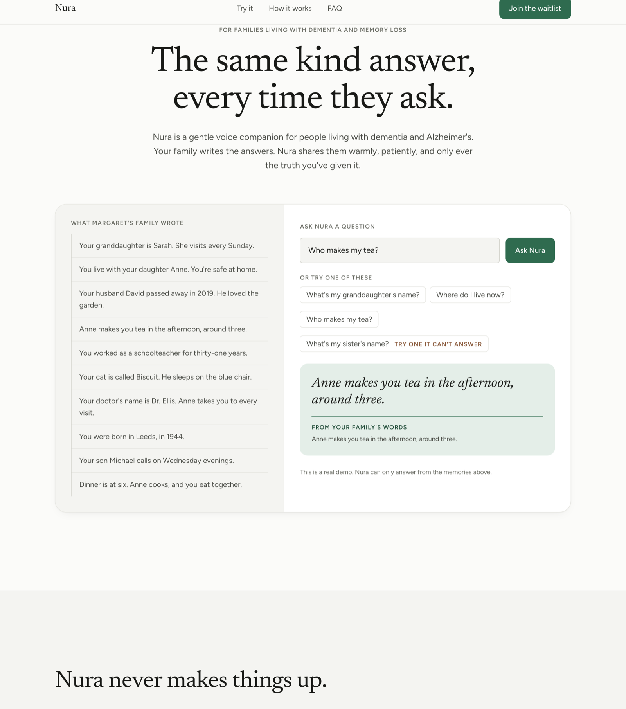

# Nura, Marketing Site

Marketing site for Nura, a voice companion for older adults living with
dementia, Alzheimer's, and memory loss. A family writes down facts about their
relative's life; the relative asks questions out loud and hears those answers
back, warmly, every time they ask.

Live: https://nura-six-alpha.vercel.app



The whole point of the product is that it never makes anything up, so the site
is built around a demo that lets you watch that happen rather than read a claim
about it. You can see the memories a fictional family wrote, type your own
question, and get back a real answer with the source memory printed underneath
it. One of the suggested questions has no matching memory on purpose, so you
can watch Nura decline to guess.

This repository is the marketing site only. There is no login and no product
here. Two routes do real work: `/api/ask` runs the demo, and `/api/waitlist`
inserts an email into a Supabase `waitlist` table server-side.

## How the answer engine works

Everything Nura does to answer a question lives in `lib/nura/`. Those three
files import nothing from Next, so they can move into the app later unchanged.

`match.ts` decides whether a question can be answered at all. It is
deterministic: it lowercases the question, drops stopwords, expands a small
synonym map, and scores each memory by the share of the question's content
words that memory accounts for, weighting proper nouns and words that are rare
across the memories. A memory is only returned if it clears a score threshold
and beats the runner-up by a margin. Two memories that fit equally well mean
the question is ambiguous, and ambiguous means no answer. There is no model
involved in any of this, and both thresholds are exported constants so they can
be tuned in one place.

`answer.ts` is where the safety guarantee lives, and the order of the code is
the guarantee:

```ts
const match = matchMemory(question);   // deterministic, no model
if (!match) return fallback;           // stop. phrase() is never reached.
const text = await phrase(match.memory); // the model sees ONLY this one memory
```

There is no path through that function on which a model response reaches the
visitor without a family-written memory behind it. `lib/nura/match.test.ts`
proves it with a spy that fails if `phrase` is ever called after a null match.

`phrase.ts` sends that single memory to Claude with a system prompt that says
to rephrase this one fact warmly and add nothing. It caps output at 100 tokens
and gives up after eight seconds, returning the memory verbatim if anything
goes wrong.

## Running the checks

```bash
npm test
```

runs the matcher tests, including the one that proves the model is unreachable
without a match.

```bash
npm run check
```

runs sixteen questions through the engine and prints the answer, the fallback
flag, the source memory and the score for each. The last six have no matching
memory; the script exits non-zero if any of them is answered anyway. Run it
after changing the memories, the synonym map, or either threshold.

## Environment variables

Copy `.env.local.example` to `.env.local`. All three variables are server-side
only, and none of them should ever be prefixed with `NEXT_PUBLIC_`.

| Variable | Used by | Without it |
| --- | --- | --- |
| `ANTHROPIC_API_KEY` | `/api/ask` | The demo returns the matched memory exactly as the family wrote it, instead of a rephrasing of it. It still works and still tells the truth. |
| `SUPABASE_URL` | `/api/waitlist` | The form shows its success state and logs a warning. The email is not stored. |
| `SUPABASE_SERVICE_ROLE_KEY` | `/api/waitlist` | As above. The service role key must never reach the browser. |

The site deploys itself from `main` on Vercel, so these have to be set in the
Vercel project settings as well as locally.

## Run it

```bash
npm install
npm run dev
```

Then open <http://localhost:3000>.

```bash
npm run build   # production build
npm run start   # serve the production build
```

## Tech stack

- **Next.js** (App Router) + **TypeScript**
- **Tailwind CSS** (v3, classic `tailwind.config.ts`)
- **Framer Motion**
- **lucide-react** for icons
- **@anthropic-ai/sdk** for the phrasing step
- **@supabase/supabase-js** for the waitlist
- **next/font/google**: Newsreader for display type, Figtree for body and UI

## Structure

```
app/
  layout.tsx           # fonts, metadata, skip link
  page.tsx             # composes the seven sections
  globals.css          # tokens as utility classes, focus rings, reduced motion
  api/ask/route.ts     # validation, rate limiting, caching over answer()
  api/waitlist/route.ts
lib/nura/
  match.ts             # question -> memory, or null
  phrase.ts            # one memory -> a warm sentence
  answer.ts            # the order that makes the guarantee
  match.test.ts
components/
  Nav.tsx
  Hero.tsx             # headline, subhead, and the demo
  Demo.tsx             # the live demo, both answer states
  Refusal.tsx          # what the visitor just watched happen
  HowItWorks.tsx
  WhoItsFor.tsx
  Faq.tsx
  Waitlist.tsx
  Footer.tsx
  ui/
    Button.tsx
    Reveal.tsx         # scroll reveal that fails visible
content/
  site.ts              # every string on the page
  memories.ts          # the ten memories and the fallback line
scripts/
  check.ts
tailwind.config.ts     # the entire colour, spacing, radius and shadow system
```

## Design notes

The idea is precise structure and a warm voice: a strict grid and strict
spacing, set in a warm serif on warm neutrals. Not homely, not clinical.

- **Colour:** a warm off-white canvas with white cards and a sunken grey for
  inset areas. Green is the only accent. Clay appears in exactly one place, on
  the demo's fallback panel, and it is not an error colour: declining to guess
  is Nura working correctly, so there is no red, no warning icon and no shake.
- **Type:** Newsreader for display, at four sizes, never bolded for emphasis.
  Figtree for body and UI. General Sans is the intended UI face but its woff2
  files are not in this repository, so Figtree stands in.
- **Depth:** one-pixel borders and background steps. There is exactly one
  shadow in the system and only the demo panel uses it.
- **Motion:** transform and opacity only, three durations, one easing curve.
  Hover changes colour and border and nothing else. Under
  `prefers-reduced-motion` everything is switched off in CSS, before the first
  paint rather than after hydration.
- **Accessibility:** semantic landmarks, one `h1`, no skipped heading levels, a
  skip link, visible focus rings everywhere, real buttons for the chips and the
  accordion, 44px hit areas, and an `aria-live` region so the demo's answer is
  announced. Every colour pair in the system was measured against WCAG AA
  rather than eyeballed.

## Adding to the demo

The memories live in `content/memories.ts`. Each one has an id, the sentence
the family wrote, and the keywords a question might use to reach it. After
adding or changing one, run `npm run check` and read the scores. If a question
that should be answered is not, the memory is usually missing a keyword. If a
question that should not be answered is, the thresholds in `lib/nura/match.ts`
are too loose.

---

Nura is not a medical device and does not provide medical advice.
